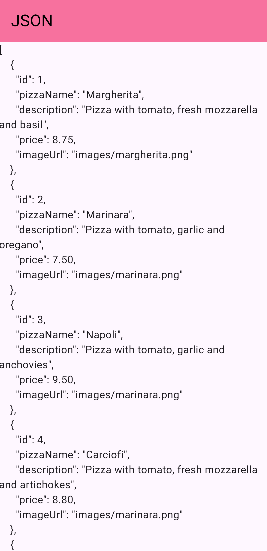
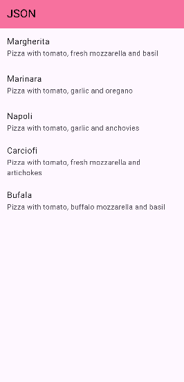
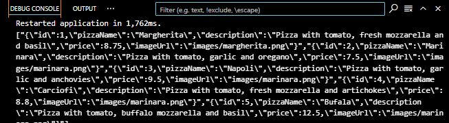

# PERSISTENSI DATA - PERTEMUAN 13
## Praktikum 1: Converting Dart models into JSON

## Praktikum 2: Reading the JSON file 

 
## Praktikum 5: Accessing the filesystem, part 2: Working with directories

 
## Praktikum 6: Using secure storage to store data

