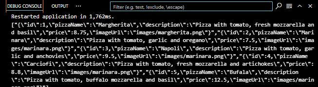

PERSISTENSI DATA
A. Praktikum 1: Converting Dart models into JSON

B. Praktikum 2: Reading the JSON file 
1. Tambahkan metode baru ke kelas Pizza, di file pizza.dart, yang disebut toJson. Ini akan
mengembalikan sebuah Map<String, dynamic> dari objek: 

 
2. Setelah Anda memiliki sebuah Map, Anda dapat menserialisasikannya kembali ke dalam string
JSON. Tambahkan metode baru di di bagian bawah kelas _MyHomePageState, di dalam file
main.dart, yang disebut convertToJSON: 

3. Metode ini mengubah objek List of Pizza kembali menjadi string Json dengan memanggil metode
jsonEncode lagi di pustaka dart_convert. 
4. Terakhir, mari panggil metode tersebut dan cetak string JSON di Debug Console. Tambahkan kode
berikut ke metode readJsonFile, tepat sebelum mengembalikan List myPizzas: 

5. Jalankan aplikasi. Anda akan melihat string JSON dicetak, seperti yang ditunjukkan pada gambar
berikut: 

C. Praktikum 3: Saving data simply with SharedPreferences 
1. Gunakan project pada pertemuan 11 bernama books. Pertama, tambahkan ketergantungan pada
shared_preferences. Dari Terminal Anda, ketikkan perintah berikut `flutter pub add shared-preferences`

2. Untuk memperbarui dependensi dalam proyek Anda, jalankan perintah flutter pub get dari jendela
Terminal. 
3. Di bagian atas file main.dart, impor shared_preferences: 

4. Di bagian atas kelas _MyHomePageState, buat variabel status integer baru bernama appCounter: 

 
5. Dalam kelas _MyHomePageState, buat metode asinkron baru yang disebut
readAndWritePreferences(): 

6. Di dalam metode readAndWritePreference, buatlah sebuah instance dari SharedPreferences: 

7. Setelah membuat instance preferensi, kita membuat kode yang mencoba baca nilai kunci
appCounter. Jika nilainya nol, setel ke 0; lalu naikkan nilainya: 

8. Setelah itu, atur nilai kunci appCounter di preferensi ke nilai baru: 

9. Memperbarui nilai status appCounter: 

10. Pada metode initState di kelas _MyHomePageState, panggil metode readAndWritePreference()

11. Dalam metode build, tambahkan kode berikut ini di dalam widget Container: 

 
12. Jalankan aplikasi. Saat pertama kali membukanya, Anda akan melihat layar yang mirip dengan
yang berikut ini: 

13. Tambahkan metode baru ke kelas _MyHomePageState yang disebut deletePreference(), yang
akan menghapus nilai yang disimpan: 

14. Dari properti onPressed dari widget ElevatedButton di metode build(), memanggil metode
deletePreference(), dengan kode di cetak tebal: 

15. Jalankan aplikasi lagi. Sekarang, saat Anda menekan tombol Reset penghitung, nilai appCounter
akan dihapus 
D. Praktikum 4: Accessing the filesystem, part 1: path_provider
Buatlah project flutter baru dengan nama path_provider
1. menambahkan dependency yang relevan ke file pubspec.yaml. Tambahkan path_provider dengan
mengetikkan perintah ini dari Terminal Anda: 

2. Di bagian atas file main.dart, tambahkan impor path_provider: 

3. Di bagian atas kelas _MyHomePageState, tambahkan variabel State yang akan kita gunakan untuk
memperbarui antarmuka pengguna: 

4. Masih dalam kelas _MyHomePageState, tambahkan metode untuk mengambil direktori temporary
dan dokumen: 

5. Pada metode initState dari kelas _MyHomePageState, panggil metode getPaths: 

6. Pada metode build _MyHomePageState, buat UI dengan dua widget Teks yang menunjukkan path
yang diambil: 
 

7. Jalankan aplikasi. Anda akan melihat layar yang terlihat seperti berikut ini: 

 
D. Praktikum 5: Accessing the filesystem, part 2: Working with directories
1. Di bagian atas berkas main.dart, impor pustaka dart:io: 

2. Di bagian atas kelas _MyHomePageState, di file main.dart, buat dua variabel State baru untuk file
dan isinya: 

3. Masih dalam kelas MyHomePageState, buat metode baru bernama writeFile dan gunakan kelas
File dari pustaka dart:io untuk membuat file baru: 
 
4. Dalam metode initState, setelah memanggil metode getPaths, dalam metode then, buat sebuah
file dan panggil metode writeFile: 

5. Buat metode untuk membaca file: 

6. Dalam metode build, di widget Column, perbarui antarmuka pengguna dengan ElevatedButton.
Ketika pengguna menekan tombol, tombol akan mencoba membaca konten file dan
menampilkannya di layar, cek kode cetak tebal: 
 
7. Jalankan aplikasi dan tekan tombol Baca File. Di bawah tombol tersebut, Anda akan melihat teks
Margherita, Capricciosa, Napoli, seperti yang ditunjukkan pada tangkapan layar berikut: 

 
F. Praktikum 6: Using secure storage to store data
1. Tambahkan flutter_secure_storage ke proyek Anda, dengan mengetik: 

2. Di file main.dart, salin kode berikut: 
 

3. Di bagian atas file main.dart, tambahkan impor yang diperlukan: 

4. Di bagian atas kelas _myHomePageState, buat penyimpanan yang aman: 

5. Di kelas _myHomePageState, tambahkan metode untuk menulis data ke penyimpanan aman: 

6. Pada metode build() dari kelas _myHomePageState, tambahkan kode yang akan menulis ke
penyimpanan ketika pengguna menekan tombol Save Value, cek kode cetak tebal: 

7. Di kelas _myHomePageState, tambahkan metode untuk membaca data dari penyimpanan aman: 

8. Pada metode build() dari kelas _myHomePageState, tambahkan kode untuk membaca dari
penyimpanan ketika pengguna menekan tombol Read Value dan memperbarui variabel myPass
State: 

9. Jalankan aplikasi dan tulis beberapa teks pilihan Anda di bidang teks. Kemudian, tekan tombol
Save Value. Setelah itu, tekan tombol Read Value. Anda akan melihat teks yang Anda ketik di kolom
teks, seperti yang ditunjukkan pada tangkapan layar berikut: 

 
Kerjakan modul praktikum ini, dan buatlah laporannya, upload project ke github dan kumpulkan
sesuai link yang disediakan 