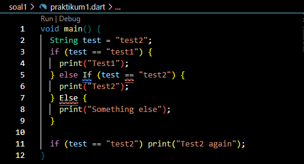
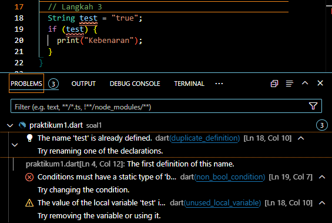

# **Tugas Praktikum: Pengantar Bahasa Pemrograman Dart - Bagian 2**

**Nama : Elis Nurhidayati**

**NIM : 2241720035**

**Kelas : TI-3C**

---
# Daftar Isi
1. [Tujuan Praktikum](#tujuan-praktikum)
2. [Soal 1 - Praktikum 1](#praktikum-1-menerapkan-control-flows-ifelse)
3. [Soal 1 - Praktikum 2](#praktikum-2-menerapkan-perulangan-while-dan-do-while)
4. [Soal 1 - Praktikum 3](#praktikum-3-menerapkan-perulangan-for-dan-break-continue)
5. [Soal 2](#2-buatlah-sebuah-program-yang-dapat-menampilkan-bilangan-prima-dari-angka-0-sampai-201-menggunakan-dart-ketika-bilangan-prima-ditemukan-maka-tampilkan-nama-lengkap-dan-nim-anda)

## Tujuan Praktikum:
- Menerapkan control flows pada bahasa pemrograman Dart
- Menerapkan perulangan pada bahasa pemrograman Dart

## 1. Silakan selesaikan Praktikum 1 sampai 3, lalu dokumentasikan berupa screenshot hasil pekerjaan beserta penjelasannya!

### *Praktikum 1: Menerapkan Control Flows ("if/else")*
- Langkah 1:
Ketik atau salin kode program berikut ke dalam fungsi main().

    

- Langkah 2:
Silakan coba eksekusi (Run) kode pada langkah 1 tersebut. Apa yang terjadi? Jelaskan!
    
    

    **Penjelasan:** Error yang muncul disebabkan karena penulisan else If dan Else dengan huruf kapital yang tidak dikenali sebagai kata kunci Dart yang valid, di mana penulisan yang benar yaitu dengan menggunakan huruf kecil semua yaitu else if dan else.

    **Perbaikan:** 

    

    **Output:**

    

- Langkah 3:
Tambahkan kode program berikut, lalu coba eksekusi (Run) kode Anda. Apa yang terjadi ? Jika terjadi error, silakan perbaiki namun tetap menggunakan if/else.

    

    **Penjelasan:** Terjadi error karena variabel test dideklarasikan dua kali pada kode pertama dan kedua, serta kondisi dalam if pada kode kedua tidak dibandingkan dengan nilai boolean.

    **Perbaikan:**

    

    **Output:**

    

### *Praktikum 2: Menerapkan Perulangan "while" dan "do-while"*
- Langkah 1:
Ketik atau salin kode program berikut ke dalam fungsi main().

    

- Langkah 2:
Silakan coba eksekusi (Run) kode pada langkah 1 tersebut. Apa yang terjadi? Jelaskan! Lalu perbaiki jika terjadi error.
    
    

    **Penjelasan:** Terjadi error dalam kode diatas karena variabel counter tidak didefinisikan sebelum digunakan. Program mencoba mengakses counter, tetapi variabel tersebut tidak ada, sehingga menyebabkan error "Undefined name".

    **Perbaikan:** 

    

    **Output:**

    

- Langkah 3:
Tambahkan kode program berikut, lalu coba eksekusi (Run) kode Anda. Apa yang terjadi ? Jika terjadi error, silakan perbaiki namun tetap menggunakan do-while.
    
    

    **Penjelasan:** Kode program yang dieksekusi tidak memiliki kesalahan sintaksis dan berjalan dengan baik. Setelah loop while selesai dan counter bernilai 33, loop do-while mencetak nilai hingga mencapai 76, lalu berhenti saat counter mencapai 77.

    **Output:**

    

### *Praktikum 3: Menerapkan Perulangan "for" dan "break-continue"*
- Langkah 1:
Ketik atau salin kode program berikut ke dalam fungsi main().

    

- Langkah 2:
Silakan coba eksekusi (Run) kode pada langkah 1 tersebut. Apa yang terjadi? Jelaskan! Lalu perbaiki jika terjadi error.
    
    

    **Penjelasan:** Kode yang dijalankan menyebabkan error karena variabel Index tidak dideklarasikan, penamaan variabel tidak konsisten, dan infinite loop.

    **Perbaikan:** 

    

    **Output:**

    

- Langkah 3:
Tambahkan kode program berikut di dalam for-loop, lalu coba eksekusi (Run) kode Anda. Apa yang terjadi ? Jika terjadi error, silakan perbaiki namun tetap menggunakan for dan break-continue.
    
    

    **Penjelasan:** Error terjadi pada kode yang ditambahkan karena penulisan If dan Else If harus huruf kecil, penamaan variabel tidak konsisten, dan penempatan logika continue dan break.

    **Perbaikan:** 

    

    **Output:**

    

---
## 2. Buatlah sebuah program yang dapat menampilkan bilangan prima dari angka 0 sampai 201 menggunakan Dart. Ketika bilangan prima ditemukan, maka tampilkan nama lengkap dan NIM Anda.

**Kode Program:**

**Output:**

