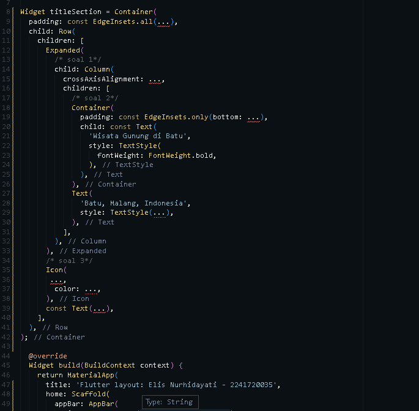

# PEMROGRAMAN MOBILE (Jobsheet 6 - Layout dan Navigasi)

Disusun oleh:

Nama : Elis Nurhidayati

NIM : 2241720035

Kelas/No. Urut : TI-3C/08

---
## **Praktikum 1: Membangun Layout di Flutter**

  

### - Langkah 1: Buat Project Baru
  

### - Langkah 2: Buka file lib/main.dart
Buka file main.dart lalu ganti dengan kode berikut. Isi nama dan NIM Anda di text title.
  
  

### - Langkah 3: Identifikasi layout diagram
1. Identifikasi baris dan kolom.

    **Jawab:** Terdapat gambar, title section (baris pertama), button section (baris kedua), dan teks deskripsi. Title section memiliki tiga anak: kolom teks, ikon bintang, dan angka rating. Button section terdiri dari tiga kolom (CALL, ROUTE, SHARE).

2. Apakah tata letaknya menyertakan kisi-kisi (grid)?

    **Jawab:** Tidak, tata letak ini tidak menggunakan kisi-kisi (grid). Elemen-elemen tersebut disusun menggunakan widget Column dan Row untuk penataan vertikal dan horizontal.

3. Apakah ada elemen yang tumpang tindih?

    **Jawab:** Tidak ada elemen yang tumpang tindih pada tata letak ini. Setiap elemen memiliki ruang sendiri yang diatur dengan baik melalui penggunaan Column, Row, dan Expanded untuk menghindari tumpang tindih.

4. Apakah UI memerlukan tab?

    **Jawab:** Tidak, UI ini tidak memerlukan tab. Tata letaknya sederhana dengan elemen-elemen yang ditampilkan dalam satu layar tanpa memerlukan navigasi tab.

5. Perhatikan area yang memerlukan alignment, padding, atau borders.

    **Jawab:** Title section rata kiri, button section memiliki jarak merata, dan padding digunakan untuk memberikan ruang antar elemen.

### - Langkah 4: Implementasi title row
Pertama, Anda akan membuat kolom bagian kiri pada judul. Tambahkan kode berikut di bagian atas metode build() di dalam kelas MyApp:

  

* soal 1 - Letakkan widget Column di dalam widget Expanded agar menyesuaikan ruang yang tersisa di dalam widget Row. Tambahkan properti crossAxisAlignment ke CrossAxisAlignment.start sehingga posisi kolom berada di awal baris.

* soal 2 - Letakkan baris pertama teks di dalam Container sehingga memungkinkan Anda untuk menambahkan padding = 8. Teks ‘Batu, Malang, Indonesia' di dalam Column, set warna menjadi abu-abu.

  

  **Penjelasan:** Pada soal 1 akan ditampilkan kolom di bagian kiri dari baris dan kontennya diratakan ke atas. Di soal 2 teks 'Batu, Malang, Indonesia' akan terlihat dengan padding di sekelilingnya, dan warnanya menjadi abu-abu, memberikan kesan lebih lembut dan tidak terlalu mencolok.


* soal 3 - Dua item terakhir di baris judul adalah ikon bintang, set dengan warna merah, dan teks "41". Seluruh baris ada di dalam Container dan beri padding di sepanjang setiap tepinya sebesar 32 piksel dan ganti isi body text.

  

  **Penjelasan:** Hasil yang ditampilkan dari soal ke-3 akan memiliki padding yang lebih besar pada baris judul, ikon bintang berwarna merah akan ditampilkan di samping angka "41", dan isi body akan menunjukkan nilai dari titleSection, menggantikan "Hello World" dengan konten baru.
---

## **Praktikum 2: Implementasi button row**

### - Langkah 1: Buat method Column _buildButtonColumn
Bagian tombol berisi 3 kolom yang menggunakan tata letak yang sama—sebuah ikon di atas baris teks. Kolom pada baris ini diberi jarak yang sama, dan teks serta ikon diberi warna primer.

Karena kode untuk membangun setiap kolom hampir sama, buatlah metode pembantu pribadi bernama buildButtonColumn(), yang mempunyai parameter warna, Icon dan Text, sehingga dapat mengembalikan kolom dengan widgetnya sesuai dengan warna tertentu.

lib/main.dart (_buildButtonColumn)

```dart
class MyApp extends StatelessWidget {
  const MyApp({super.key});

  @override
  Widget build(BuildContext context) {
    // ···
  }

  Column _buildButtonColumn(Color color, IconData icon, String label) {
    return Column(
      mainAxisSize: MainAxisSize.min,
      mainAxisAlignment: MainAxisAlignment.center,
      children: [
        Icon(icon, color: color),
        Container(
          margin: const EdgeInsets.only(top: 8),
          child: Text(
            label,
            style: TextStyle(
              fontSize: 12,
              fontWeight: FontWeight.w400,
              color: color,
            ),
          ),
        ),
      ],
    );
  }
}
```

### - Langkah 2: Buat widget buttonSection
Buat Fungsi untuk menambahkan ikon langsung ke kolom. Teks berada di dalam Container dengan margin hanya di bagian atas, yang memisahkan teks dari ikon.

Bangun baris yang berisi kolom-kolom ini dengan memanggil fungsi dan set warna, Icon, dan teks khusus melalui parameter ke kolom tersebut. Sejajarkan kolom di sepanjang sumbu utama menggunakan MainAxisAlignment.spaceEvenly untuk mengatur ruang kosong secara merata sebelum, di antara, dan setelah setiap kolom. Tambahkan kode berikut tepat di bawah deklarasi titleSection di dalam metode build():

lib/main.dart (buttonSection)

```dart
Color color = Theme.of(context).primaryColor;

Widget buttonSection = Row(
  mainAxisAlignment: MainAxisAlignment.spaceEvenly,
  children: [
    _buildButtonColumn(color, Icons.call, 'CALL'),
    _buildButtonColumn(color, Icons.near_me, 'ROUTE'),
    _buildButtonColumn(color, Icons.share, 'SHARE'),
  ],
);
```

### - Langkah 3: Tambah button section ke body
Tambahkan variabel buttonSection ke dalam body dibawah titleSection.

**Hasil yang ditampilkan:**
  

**Penjelasan:** Dari hasil pada Button Section, ditampilkan tiga tombol: CALL, ROUTE, dan SHARE, yang disusun secara horizontal menggunakan widget Row dengan jarak yang merata menggunakan (MainAxisAlignment.spaceEvenly). Setiap tombol dibangun menggunakan fungsi _buildButtonColumn() yang menampilkan ikon di atas label teks. Ikon dan teks diberi warna primer aplikasi (ungu), memberikan akses mudah untuk melakukan panggilan, melihat rute, atau membagikan informasi tentang destinasi wisata.

---

## **Praktikum 3: Implementasi text section**

### - Langkah 1: Buat widget textSection
Tentukan bagian teks sebagai variabel. Masukkan teks ke dalam Container dan tambahkan padding di sepanjang setiap tepinya. Tambahkan kode berikut tepat di bawah deklarasi buttonSection:

```dart
Widget textSection = Container(
  padding: const EdgeInsets.all(32),
  child: const Text(
    'Carilah teks di internet yang sesuai '
    'dengan foto atau tempat wisata yang ingin '
    'Anda tampilkan. '
    'Tambahkan nama dan NIM Anda sebagai '
    'identitas hasil pekerjaan Anda. '
    'Selamat mengerjakan 🙂.',
    softWrap: true,
  ),
);
```
Dengan memberi nilai softWrap = true, baris teks akan memenuhi lebar kolom sebelum membungkusnya pada batas kata.

### - Langkah 2: Tambahkan variabel text section ke body
Tambahkan widget variabel textSection ke dalam body dibawah buttonSection.

**Hasil yang ditampilkan:**
  

**Penjelasan:** Di langkah 1, widget textSection dibuat menggunakan Container dengan padding 32 pixel. Di dalamnya terdapat widget Text yang menjelaskan tentang Gunung Bromo sebagai destinasi wisata, termasuk keindahan alam dan daya tariknya. Properti softWrap: true memastikan teks membungkus rapi tanpa memotong kata. Kemudian pada langkah 2, Widget textSection ditambahkan ke dalam body dari Scaffold di bawah buttonSection. Hal ini memberikan informasi tambahan kepada pengguna tentang Gunung Bromo setelah mereka melihat tombol aksi.

---

## **Praktikum 4: Implementasi image section**

### - Langkah 1: Siapkan aset gambar
Buatlah folder images di root project layout_flutter. Masukkan file gambar tersebut ke folder images, lalu set nama file tersebut ke file pubspec.yaml.

  

### - Langkah 2: Tambahkan gambar ke body
Tambahkan aset gambar ke dalam body seperti berikut:
  
  BoxFit.cover memberi tahu kerangka kerja bahwa gambar harus sekecil mungkin tetapi menutupi seluruh kotak rendernya.

### - Langkah 3: Terakhir, ubah menjadi ListView
Pada langkah terakhir ini, atur semua elemen dalam ListView, bukan Column, karena ListView mendukung scroll yang dinamis saat aplikasi dijalankan pada perangkat yang resolusinya lebih kecil.

  

**Hasil yang ditampilkan:** 
  

**Penjelasan:** Implementasi image section dalam main.dart ini memperkaya tampilan dan pengalaman pengguna dengan menambahkan elemen visual yang menarik, lalu penggunaan BoxFit.cover memastikan gambar mengisi area yang tersedia tanpa kehilangan proporsi, sementara perubahan dari Column menjadi ListView memungkinkan pengguna menggulir dengan mudah. Kombinasi ini menciptakan pengalaman yang menyenangkan dan informatif, membuat konten terasa lebih hidup.