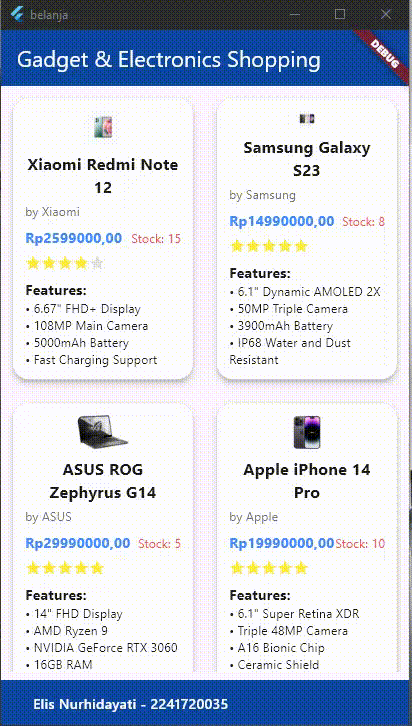

# **Pertemuan 6 Layout dan Navigasi**

**Nama : Elis Nurhidayati**

**NIM   : 2241720035**

**Kelas : TI-3C**

---
# Daftar Isi
1. [Praktikum 5](#praktikum-5-membangun-navigasi-di-flutter)
3. [Tugas Praktikum 2](#tugas-prakitkum-2)
4. [Tampilan Akhir](#output-tampilan-aplikasi-belanja-sesuai-tugas-praktikum-2)

## *Praktikum 5: Membangun Navigasi di Flutter*

Tampilan Akhir yang akan Dibuat :

## Langkah 1: Siapkan project baru
- Susunan folder lib pada project 'belanja'
    

## Langkah 2: Mendefinisikan Route

- Route home_page.dart

- Route item_page.dart

## Langkah 3: Lengkapi Kode di main.dart

- Kode di dalam main.dart

## Langkah 4: Membuat data model

- Folder model berisi data item.dart

## Langkah 5: Lengkapi kode di class HomePage

- Sumber data ListView diambil dari model List dari object Item

## Langkah 6: Membuat ListView dan itemBuilder

- Menampilkan ListView menggunakan itemBuilder. Untuk menunjukkan batas data satu dan berikutnya digunakan widget Card.

**Menjalankan aplikasi pada emulator.**

- Tampilan aplikasi yang telah dibuat pada emulator

## Langkah 7: Menambahkan aksi pada ListView

- Menambahkan aksi pada ListView menggunakan widget InkWell

- Tampilan aplikasi setelah ListView ditekan

# **Tugas Prakitkum 2**
1. Untuk melakukan pengiriman data ke halaman berikutnya, cukup menambahkan informasi arguments pada penggunaan Navigator. Perbarui kode pada bagian Navigator.

    

2. Pembacaan nilai yang dikirimkan pada halaman sebelumnya dapat dilakukan menggunakan ModalRoute. Tambahkan kode berikut pada blok fungsi build dalam halaman ItemPage. Setelah nilai didapatkan, anda dapat menggunakannya seperti penggunaan variabel pada umumnya. (https://docs.flutter.dev/cookbook/navigation/navigate-with-arguments)

    

3. Pada hasil akhir dari aplikasi belanja yang telah anda selesaikan, tambahkan atribut foto produk, stok, dan rating. Ubahlah tampilan menjadi GridView seperti di aplikasi marketplace pada umumnya.

    
    

4. Silakan implementasikan Hero widget pada aplikasi belanja Anda dengan mempelajari dari sumber ini: https://docs.flutter.dev/cookbook/navigation/hero-animations

    

5. Sesuaikan dan modifikasi tampilan sehingga menjadi aplikasi yang menarik. Selain itu, pecah widget menjadi kode yang lebih kecil. Tambahkan Nama dan NIM di footer aplikasi belanja Anda.

    

## **Output Tampilan Aplikasi Belanja sesuai Tugas Praktikum 2:**

