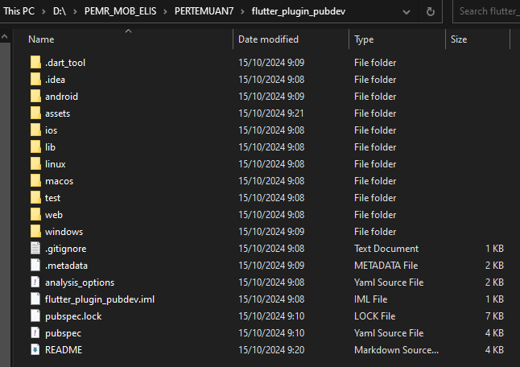
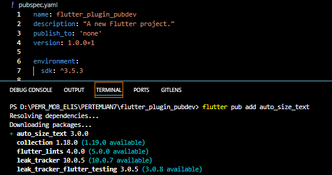
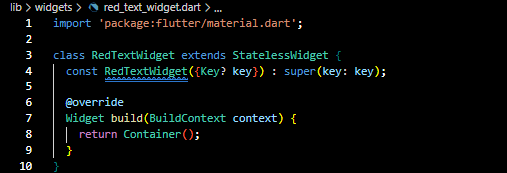
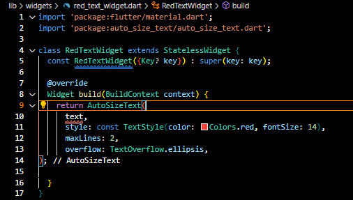
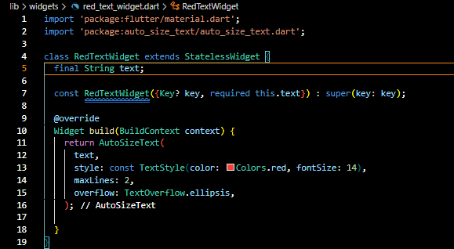
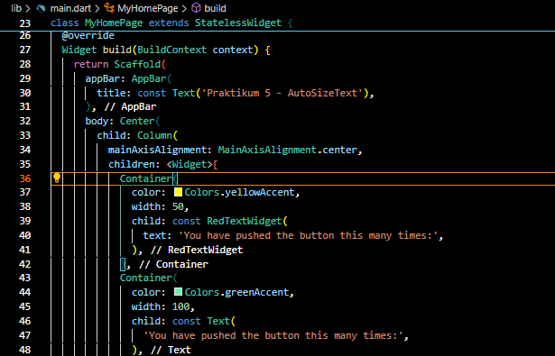
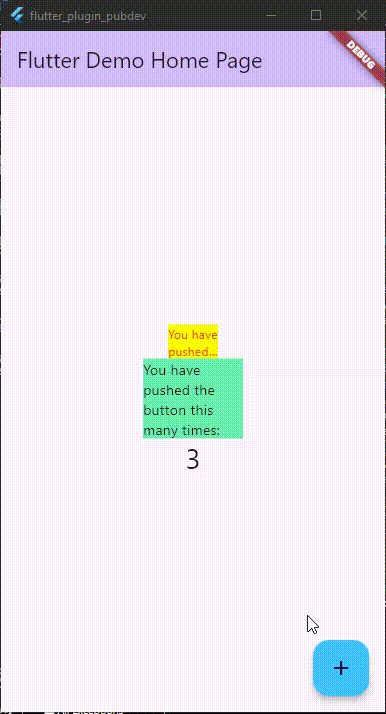

# **Tugas Praktikum: Manajemen Plugin**

**Nama : Elis Nurhidayati**

**NIM : 2241720035**

**Kelas : TI-3C**

---
# Daftar Isi
1. [Tujuan Praktikum](#tujuan-praktikum)
2. [Soal 1](#1-selesaikan-praktikum-tersebut-lalu-dokumentasikan-dan-push-ke-repository-anda-berupa-screenshot-hasil-pekerjaan-beserta-penjelasannya-di-file-readmemd)
3. [Soal 2](#2-jelaskan-maksud-dari-langkah-2-pada-praktikum-tersebut)
4. [Soal 3](#3-jelaskan-maksud-dari-langkah-5-pada-praktikum-tersebut)
5. [Soal 4](#4-pada-langkah-6-terdapat-dua-widget-yang-ditambahkan-jelaskan-fungsi-dan-perbedaannya)
6. [Soal 5](#5-jelaskan-maksud-dari-tiap-parameter-yang-ada-di-dalam-plugin-auto_size_text-berdasarkan-tautan-pada-dokumentasi-ini-)

## Tujuan Praktikum
1. Menjelaskan manfaat plugin
2. Memasang plugin ke dalam project flutter
3. Memanfaatkan plugin dalam aplikasi

## 1. Selesaikan Praktikum tersebut, lalu dokumentasikan dan push ke repository Anda berupa screenshot hasil pekerjaan beserta penjelasannya di file README.md!

### *Langkah 1: Buat Project Baru*
Buatlah sebuah project flutter baru dengan nama flutter_plugin_pubdev. Lalu jadikan repository di GitHub Anda dengan nama flutter_plugin_pubdev.

### *Langkah 2: Menambahkan Plugin*
Tambahkan plugin auto_size_text menggunakan perintah berikut di terminal.

`flutter pub add auto_size_text`

Jika berhasil, maka akan tampil nama plugin beserta versinya di file pubspec.yaml pada bagian dependencies.

### *Langkah 3: Buat file red_text_widget.dart*
Buat file baru bernama red_text_widget.dart di dalam folder lib lalu isi kode seperti berikut.

### Langkah 4: *Tambah Widget AutoSizeText*
Masih di file red_text_widget.dart, untuk menggunakan plugin auto_size_text, ubahlah kode return Container() menjadi seperti berikut.

Setelah Anda menambahkan kode di atas, Anda akan mendapatkan info error. Mengapa demikian? Jelaskan dalam laporan praktikum Anda!

**Penjelasan:** Setelah menambahkan kode tersebut, muncul error karena variabel `text` belum dideklarasikan dan belum dijadikan parameter di constructor. Variabel ini diperlukan oleh `AutoSizeText` untuk menampilkan teks.

### Langkah 5: *Buat Variabel text dan parameter di constructor*
Tambahkan variabel text dan parameter di constructor seperti berikut.

Langkah 6: Tambahkan widget di main.dart
Buka file main.dart lalu tambahkan di dalam children: pada class _MyHomePageState

**Output:**

## 2. Jelaskan maksud dari langkah 2 pada praktikum tersebut!
**Penjelasan:** Menambahkan plugin auto_size_text ke dalam project Flutter. Plugin ini memungkinkan teks untuk secara otomatis menyesuaikan ukuran font agar muat dalam batas maksimal lebar atau jumlah baris tertentu. Dengan menambahkan plugin menggunakan perintah flutter pub add auto_size_text, dependensi ini akan ditambahkan ke dalam file pubspec.yaml secara otomatis, sehingga dapat digunakan dalam proyek.

## 3. Jelaskan maksud dari langkah 5 pada praktikum tersebut!
**Penjelasan:** Pada langkah 5 melibatkan pembuatan variabel text dan penambahannya sebagai parameter dalam constructor RedTextWidget. Ini dilakukan agar teks yang akan ditampilkan oleh AutoSizeText dapat diteruskan dari luar kelas saat widget dipanggil. Dengan menambahkan variabel dan parameter ini, kita membuat widget menjadi lebih fleksibel dan dapat digunakan untuk menampilkan teks yang berbeda.

## 4. Pada langkah 6 terdapat dua widget yang ditambahkan, jelaskan fungsi dan perbedaannya!
**Penjelasan:** 

1. Fungsi:

    - Widget RedTextWidget: Ini adalah widget kustom yang menggunakan AutoSizeText untuk menampilkan teks dengan warna merah dan ukuran font yang menyesuaikan secara otomatis agar muat dalam maksimal dua baris. Jika teks terlalu panjang, maka akan dipotong dan ditampilkan dengan tanda elipsis (...).
    - Widget Text: Merupakan widget bawaan Flutter untuk menampilkan teks. Pada contoh ini, teks ditampilkan tanpa penyesuaian otomatis ukuran font dan tidak memiliki batasan jumlah baris atau fitur elipsis.

2. Perbedaan Utama:

    - RedTextWidget menggunakan AutoSizeText yang dapat menyesuaikan ukuran font sesuai lebar atau jumlah baris yang ditentukan, sedangkan Text menampilkan teks dengan ukuran tetap.
    - AutoSizeText memiliki opsi untuk mengatur jumlah maksimal baris (maxLines) dan menangani teks yang terlalu panjang dengan elipsis (overflow).

## 5. Jelaskan maksud dari tiap parameter yang ada di dalam plugin auto_size_text berdasarkan tautan pada dokumentasi [ini](https://pub.dev/documentation/auto_size_text/latest/)  !
**Penjelasan:**
- `text`
Merupakan teks yang akan ditampilkan oleh widget AutoSizeText. Teks ini dapat secara otomatis diubah ukurannya agar sesuai dengan batas ruang yang tersedia.

- `style`
Digunakan untuk menentukan gaya teks, seperti ukuran font, warna, tebal, miring, dan lainnya. Anda dapat menyesuaikan tampilan teks sesuai kebutuhan dengan parameter ini.

- `minFontSize`
Menentukan ukuran font minimum yang dapat digunakan saat teks secara otomatis diubah ukurannya. Ini memastikan bahwa teks tidak akan diperkecil melampaui ukuran yang dapat dibaca.

- `maxFontSize`
Menentukan ukuran font maksimum yang dapat digunakan saat teks secara otomatis diubah ukurannya. Batas ini mencegah teks dari menjadi terlalu besar.

- `stepGranularity`
Menentukan langkah perubahan ukuran font saat AutoSizeText mencoba menemukan ukuran font yang sesuai. Semakin kecil nilainya, semakin halus perubahan ukurannya.

- `presetFontSizes`
Merupakan daftar ukuran font yang telah ditentukan sebelumnya yang akan dicoba digunakan untuk teks. Jika diatur, ukuran font akan dipilih dari daftar ini secara berurutan hingga menemukan yang sesuai.

- `overflow`
Menentukan bagaimana penanganan teks yang tidak dapat ditampilkan dalam ruang yang tersedia, seperti dipotong (TextOverflow.clip) atau ditampilkan dengan elipsis (TextOverflow.ellipsis).

- `wrapWords`
Parameter boolean yang menentukan apakah kata-kata harus dibungkus atau tidak saat teks diubah ukurannya. Jika false, ukuran font akan dikurangi lebih banyak sebelum memulai pembungkusan kata.

- `textAlign`
Mengatur perataan teks, seperti kiri (TextAlign.left), kanan (TextAlign.right), atau tengah (TextAlign.center).

- `textDirection`
Menentukan arah teks, misalnya dari kiri ke kanan (TextDirection.ltr) atau dari kanan ke kiri (TextDirection.rtl).

- `maxLines`
Menentukan jumlah maksimum baris yang dapat digunakan untuk menampilkan teks. Jika teks melebihi jumlah baris ini, maka akan di-truncate sesuai pengaturan overflow.

- `softWrap`
Mengontrol apakah teks diizinkan untuk membungkus ke baris berikutnya jika melebihi panjang baris.

- `locale`
Mengatur lokalitas teks untuk penanganan gaya teks, seperti arah teks atau aturan tata letak bahasa.

- `semanticsLabel`
Merupakan label yang digunakan oleh pembaca layar untuk memberikan informasi tambahan tentang widget kepada pengguna dengan kebutuhan khusus.

- `group`
Memungkinkan beberapa AutoSizeText widget untuk dikelompokkan bersama dan memastikan mereka menggunakan ukuran font yang sama. Hal ini berguna untuk menjaga konsistensi dalam tampilan beberapa widget teks.